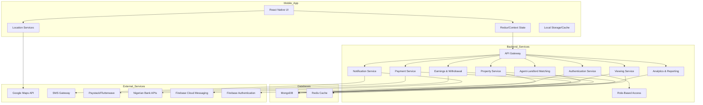

```mermaid
  graph TD
    subgraph Mobile_App
      UI[React Native UI]
      STATE[Redux/Context State]
      LOCATION[Location Services]
      CACHE[Local Storage/Cache]
    end

    subgraph Backend_Services
        API[API Gateway]
        AUTH[Authentication Service]
        RBAC[Role-Based Access]
        PROPERTY[Property Service]
        VIEWING[Viewing Service]
        PAYMENT[Payment Service]
        NOTIFICATION[Notification Service]
        MATCHING[Agent-Landlord Matching]
        EARNINGS[Earnings & Withdrawal]
        ANALYTICS[Analytics & Reporting]
    end

    subgraph Databases
        MONGO[MongoDB]
        REDIS[Redis Cache]
    end

    subgraph External_Services
        MAPS[Google Maps API]
        SMS[SMS Gateway]
        PAYSTACK[Paystack/Flutterwave]
        BANKS[Nigerian Bank APIs]
        PUSH[Firebase Cloud Messaging]
        FIREBASE_AUTH[Firebase Authentication]
    end

    UI --> STATE
    STATE --> API
    UI --> LOCATION
    LOCATION --> MAPS

    API --> AUTH
    AUTH --> FIREBASE_AUTH
    AUTH --> RBAC

    API --> PROPERTY
    API --> VIEWING
    API --> PAYMENT
    API --> NOTIFICATION
    API --> MATCHING
    API --> EARNINGS
    API --> ANALYTICS

    PROPERTY --> MONGO
    VIEWING --> MONGO
    PAYMENT --> MONGO
    MATCHING --> MONGO
    EARNINGS --> MONGO
    ANALYTICS --> MONGO

    PAYMENT --> PAYSTACK
    EARNINGS --> BANKS
    NOTIFICATION --> SMS
    NOTIFICATION --> PUSH

    PROPERTY --> REDIS
    VIEWING --> REDIS
```
